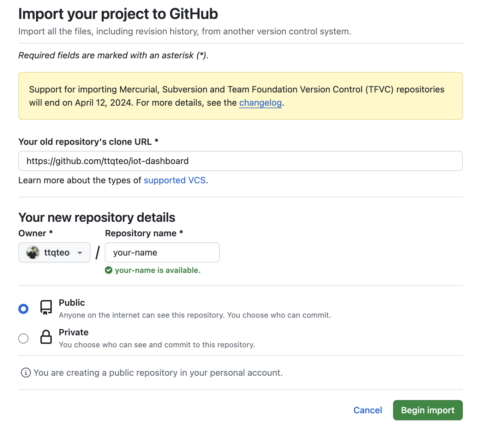
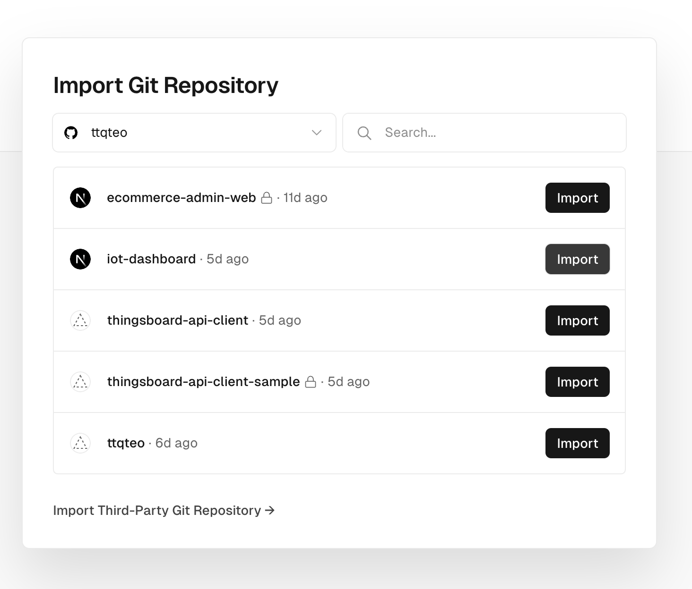
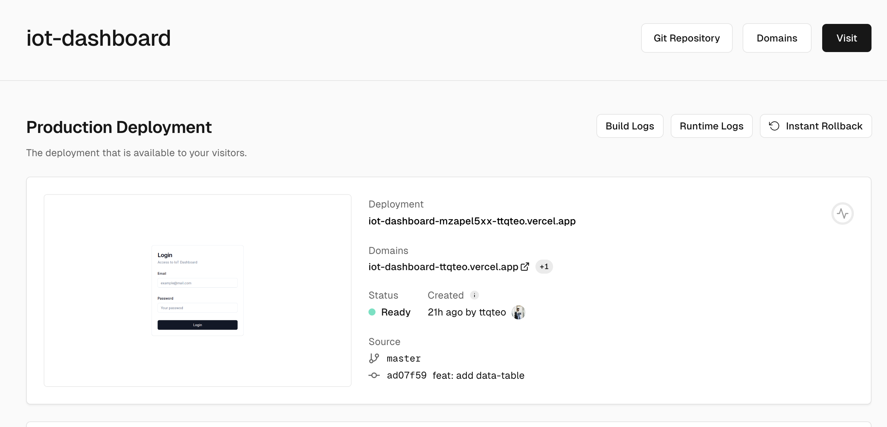

# How to deploy

**Step 1: Go to this link and authenticate your Github Account** 
Import [*https://github.com/new/import*](https://github.com/new/import)
Copy this
```txt
https://github.com/ttqteo/iot-dashboard
```
And fill like t his


**Step 2: Deploy your app on Vercel**
* Authenticate with your Github account
[https://vercel.com](https://vercel.com/dashboard)
* Choose your project to deploy
[https://vercel.com/new](https://vercel.com/new)
* Click `Import` repository with "your-name"

* Waiting for deploy
* Get back to dashboard and click to your project

* Click **Visit** and enjoy your website

**ENJOY!**